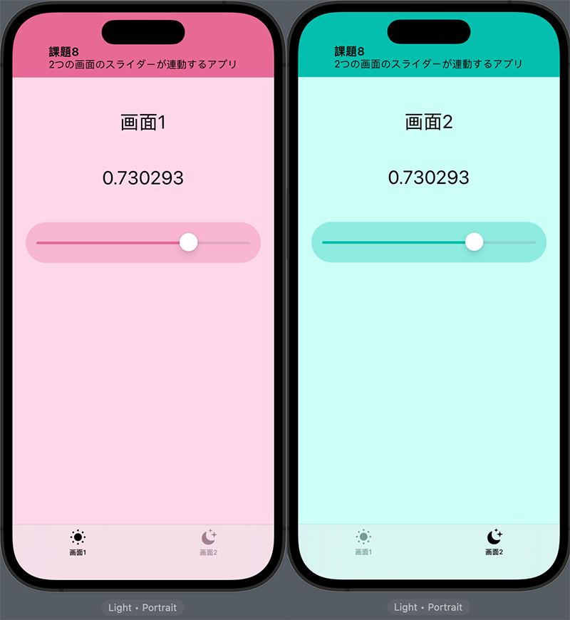

# 課題8 2つの画面のスライダーが連動するアプリ
## Overview

2つの画面があり、それぞれにスライダーが設置されている。それぞれの画面はタブで切り替える。

2つの画面にあるスライダーは連動する。

## Memo
<ul>
  <li>SwiftUI</li>
  <li>tabView</li>
  <li>@State, @Binding</li>
  <li>AssetsでColorを定義。</li>
</ul>
